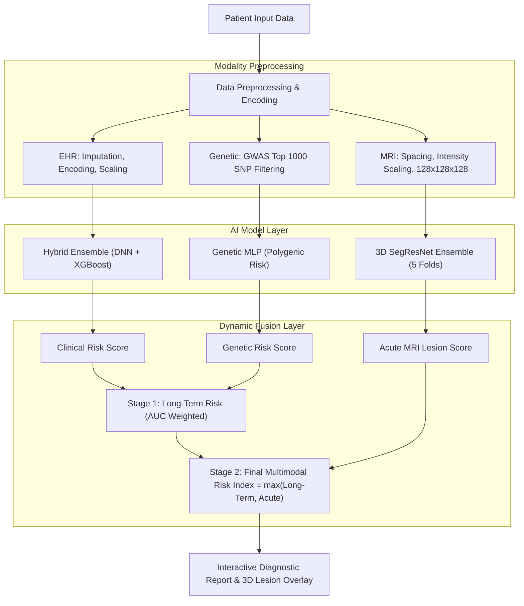
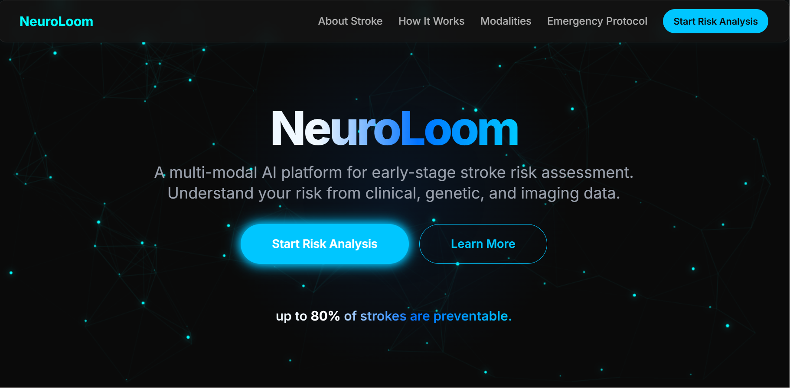
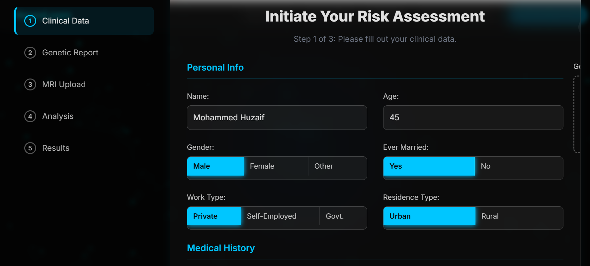
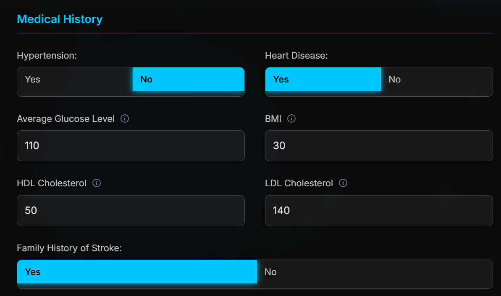
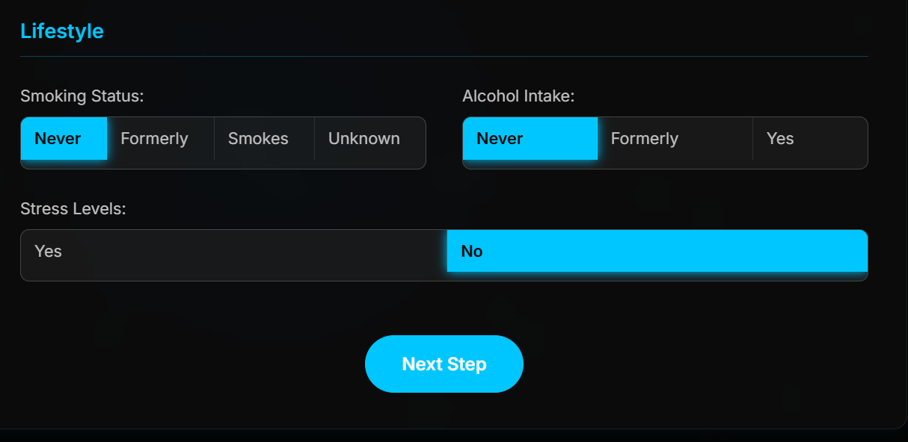
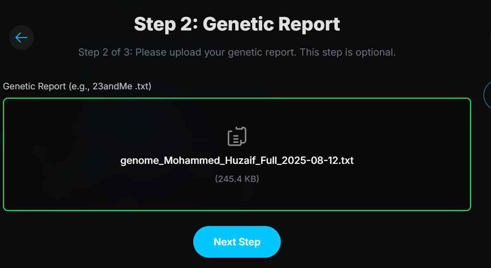
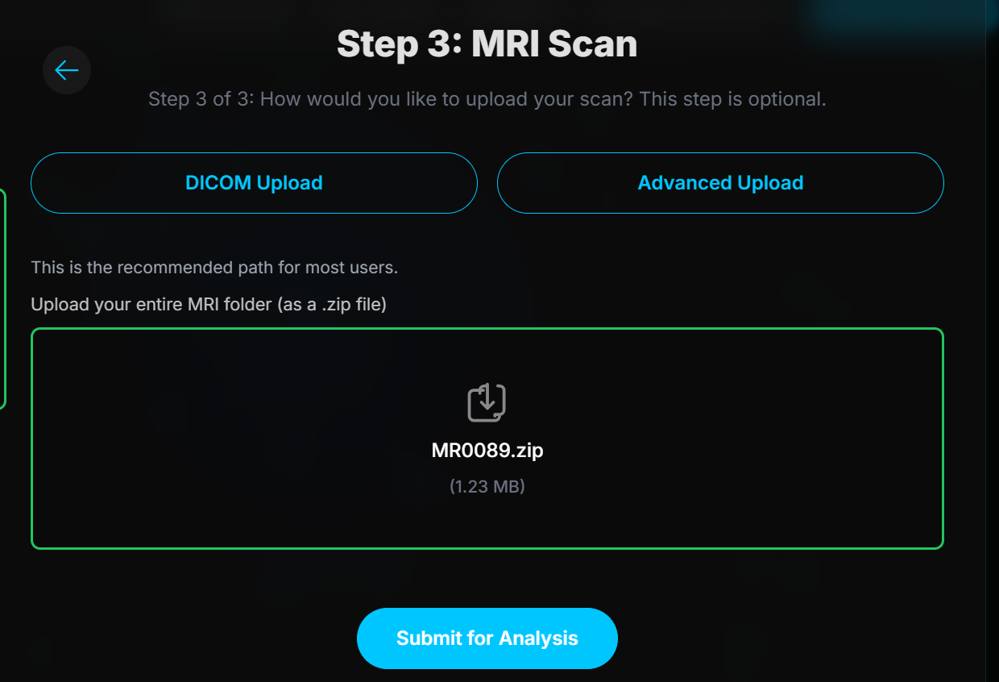
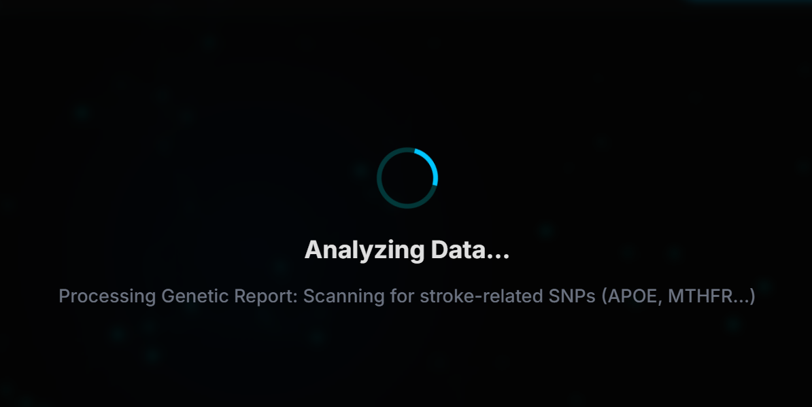
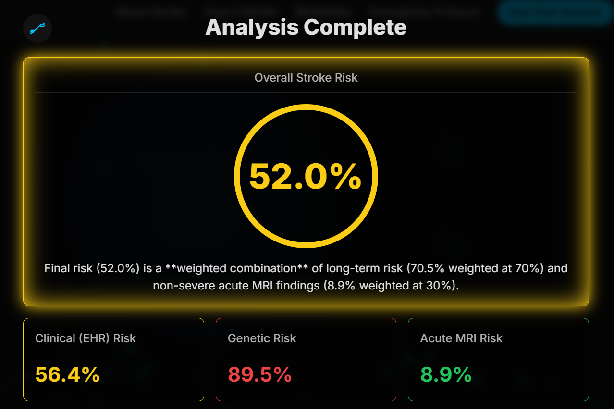
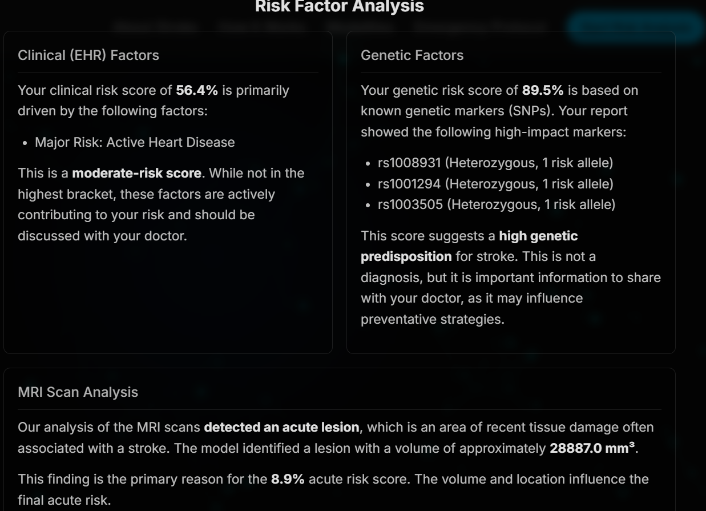

# 🧠 Multimodal Stroke Risk Detection & Pathological Lesion Analysis

[](https://www.python.org/)
[](https://github.com/)
[](LICENSE)

An end-to-end clinical AI framework that integrates **3D Brain Magnetic Resonance Imaging (MRI)**, **Electronic Health Records (EHR)**, and **Genetic/GWAS Polygenic Data** to deliver highly accurate, individualized stroke risk predictions and 3D lesion segmentations in real-time.

---

## 📌 Table of Contents
- [Key Features](#-key-features)
- [System Architecture](#-system-architecture)
- [Modality Breakdown & Models](#-modality-breakdown--models)
- [Experimental Results](#-experimental-results)
- [Project Directory Structure](#-project-directory-structure)
- [Application Screenshots](#-application-screenshots)
- [Installation & Setup](#-installation--setup)
- [Running the Application](#-running-the-application)
- [API Documentation](#-api-documentation)
- [Citation & Research Paper](#-citation--research-paper)

---

## 🚀 Key Features

* **Tri-Modal Artificial Intelligence Integration**: Synthesizes acute imaging markers, chronic clinical indicators, and lifetime genetic predispositions.
* **3D Volumetric Lesion Segmentation**: 5-Fold SegResNet deep learning ensemble trained on multimodal DWI and ADC MRI sequences (ISLES benchmark standard).
* **Hybrid Clinical Risk Classification**: Soft-voting ensemble combining Deep Neural Network (DNN) feature extraction with XGBoost gradient boosting over 16 physiological attributes.
* **Polygenic Susceptibility Prediction**: Multilayer Perceptron (MLP) analyzing top-1000 GWAS-significant Single Nucleotide Polymorphisms (SNPs).
* **Two-Stage Dynamic Fusion Engine**: Combines long-term clinical and genetic risk weighted by their discriminatory power (macro AUC), overriding with acute MRI pathology indicators when acute lesions are present.
* **Interactive Clinical Dashboard**: Real-time diagnostic web dashboard featuring patient profile loading, risk gauges, 3D slice visualization, and factor breakdown.

---

## 🏛️ System Architecture



---

## 🔬 Modality Breakdown & Models

### 1. 🩻 MRI Lesion Segmentation Module
* **Model**: 5-Fold SegResNet Ensemble (MONAI & PyTorch)
* **Inputs**: 3D NIfTI (`.nii`, `.nii.gz`), DICOM sequences, or ZIP archive of DICOM slices (DWI & ADC channels).
* **Output**: Binary 3D stroke lesion mask, lesion volume ($\text{mm}^3$), center-of-mass coordinates, and normalized acute severity score.

### 2. 📋 Electronic Health Record (EHR) Module
* **Model**: Soft-voting ensemble of Deep Neural Network (DNN) + XGBoost Classifier.
* **Features**: 16 clinical metrics (Age, Hypertension, Heart Disease, Average Glucose, BMI, HDL, LDL, Cholesterol Index, Smoking Status, Stress Levels, Alcohol Intake, Family History, etc.).
* **Target Classes**: 4-Tier Risk Categorization (`No`, `Low`, `Medium`, `High`).

### 3. 🧬 Genetic Susceptibility Module
* **Model**: Multi-Layer Perceptron (MLP) with Batch Normalization and Dropout.
* **Features**: Top 1,000 statistically significant SNPs extracted via Genome-Wide Association Study (GWAS) and PLINK analysis.
* **Output**: Continuous polygenic risk score (0.0 – 1.0).

---

## 📊 Experimental Results

| Modality / Module | Primary Model Architecture | Accuracy | Precision | Recall | F1-Score | AUC-ROC / Dice |
| :--- | :--- | :---: | :---: | :---: | :---: | :---: |
| **Clinical EHR** | DNN + XGBoost Ensemble | **85.91%** | **86.04%** | **85.91%** | **85.88%** | **97.11%** (Macro AUC) |
| **3D MRI Scans** | 5-Fold SegResNet Ensemble | — | **88.44%** | **80.49%** | **84.28%** | **78.98%** (Mean Dice) |
| **Genetic GWAS** | Filtered MLP Architecture | **88.81%** | **86.49%** | **88.81%** | **86.90%** | **77.82%** (Test AUC) |

---

## 📂 Project Directory Structure

```text
MULTIMODAL_STROKE_DETECTION/
│
├── app.py                      # Flask REST API server and inference pipeline
├── index.html                  # Interactive clinician UI dashboard
├── requirements.txt            # Python dependencies
├── requirements.py             # Dependency validation and auto-installer
├── README.md                   # Project documentation
│
├── screenshots/                # Application UI demo screenshots
│   ├── 01_hero_landing_page.png
│   ├── 02_clinical_data_input.png
│   ├── 03_medical_history_inputs.png
│   ├── 04_lifestyle_inputs.png
│   ├── 05_genetic_report_upload.png
│   ├── 06_mri_scan_upload.png
│   ├── 07_analyzing_pipeline.png
│   ├── 08_multimodal_risk_results.png
│   └── 09_risk_factor_breakdown.png
│
├── data/                       # Datasets & GWAS association results
│   ├── ehr/                    # Clinical EHR tabular data
│   └── genetic/                # GWAS association files (gwas_results.assoc)
│
├── models/                     # Trained deep learning & ensemble model weights
│   ├── ehr/                    # dnn_model.h5, xgboost_model.pkl, scalers
│   ├── Genetic/                # genetic_mlp_model_filtered.keras
│   └── mri/                    # MRI_best_model_fold_1..5.pkl
│
├── notebooks/                  # Model training and experimentation notebooks
│   ├── ehr_model.ipynb         # EHR preprocessing, SMOTE, DNN & XGBoost
│   ├── genetic.ipynb           # PLINK parsing, SNP filtering & Genetic MLP
│   └── segresnet-model.ipynb   # 3D MONAI SegResNet training & validation
│
├── INPUTS/                     # Test sample inputs (NIfTI MRI scans & test data)
└── research_paper/             # Academic publication & full documentation
    └── ResearchPaper.pdf
```

---

## 📸 Application Screenshots

### 1. Landing Page & Hero Section


### 2. Clinical EHR Assessment Form
| Personal & Demographics | Medical History | Lifestyle Factors |
| :---: | :---: | :---: |
|  |  |  |

### 3. Genetic & 3D MRI Upload
| GWAS SNP Report Upload | 3D DICOM / NIfTI MRI Upload | Pipeline Processing |
| :---: | :---: | :---: |
|  |  |  |

### 4. Multimodal Fusion Results & Risk Factor Analysis
| Overall Risk Gauge & Modality Scores | Detailed Contributing Factors & Lesion Biomarkers |
| :---: | :---: |
|  |  |

---

## ⚙️ Installation & Setup

### 1. Prerequisites
* Python `3.10` or `3.11` recommended.
* Git

### 2. Clone the Repository
```bash
git clone https://github.com/your-username/multimodal-stroke-detection.git
cd multimodal-stroke-detection
```

### 3. Create & Activate a Virtual Environment
* **PowerShell (Windows)**:
  ```powershell
  python -m venv .venv
  .\.venv\Scripts\Activate.ps1
  ```
* **Command Prompt (Windows)**:
  ```cmd
  .venv\Scripts\activate.bat
  ```
* **Linux / macOS**:
  ```bash
  python3 -m venv .venv
  source .venv/bin/activate
  ```

### 4. Install Dependencies
Run the built-in installer script:
```bash
python requirements.py
```
*Or install directly via `pip`:*
```bash
pip install -r requirements.txt
```

---

## 🖥️ Running the Application

1. **Start the Flask Backend**:
   ```bash
   python app.py
   ```
   The backend server will start at: `http://127.0.0.1:8080`

2. **Access the Web Dashboard**:
   Open `index.html` in your web browser, or navigate to `http://127.0.0.1:8080/` in your browser.

---

## 📡 API Documentation

### `POST /api/predict`
Executes unimodal or multimodal inference across any combination of uploaded data.

* **Content-Type**: `multipart/form-data`
* **Parameters**:
  * `mri_file` *(optional)*: `.nii`, `.nii.gz`, `.dcm`, or `.zip` of DICOM slices.
  * `ehr_data` *(optional)*: JSON string containing 16 patient attributes.
  * `genetic_file` *(optional)*: Text file containing SNP genotype records.

#### Example Response:
```json
{
  "status": "success",
  "multimodal_fusion": {
    "final_risk_percentage": 78.45,
    "risk_level": "High Risk",
    "fusion_logic": "Acute MRI pathology threshold active",
    "contributing_weights": {
      "ehr_weight": 0.5725,
      "genetic_weight": 0.4275
    }
  },
  "mri_analysis": {
    "lesion_detected": true,
    "lesion_volume_mm3": 4323.0,
    "mri_risk_score": 0.838
  },
  "ehr_analysis": {
    "predicted_class": "High",
    "expected_risk_score": 0.762
  },
  "genetic_analysis": {
    "polygenic_risk_score": 0.684
  }
}
```

---

## 📑 Citation & Research Paper

The complete mathematical formulation, clinical motivation, and benchmark comparisons are detailed in our paper located in [`research_paper/ResearchPaper.pdf`](research_paper/ResearchPaper.pdf).
